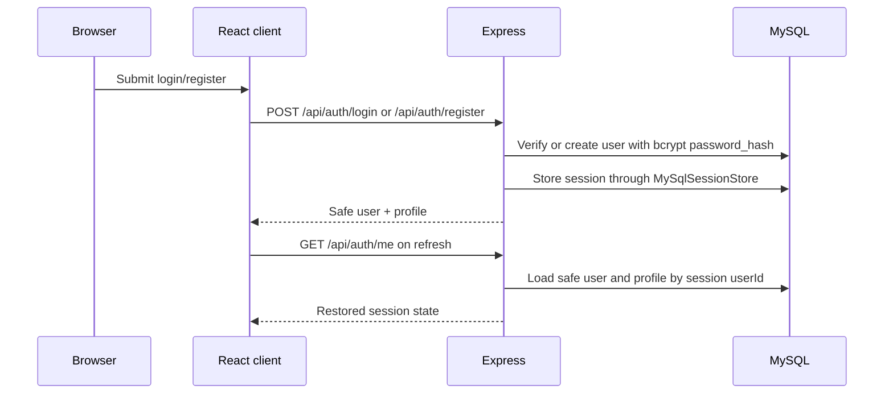
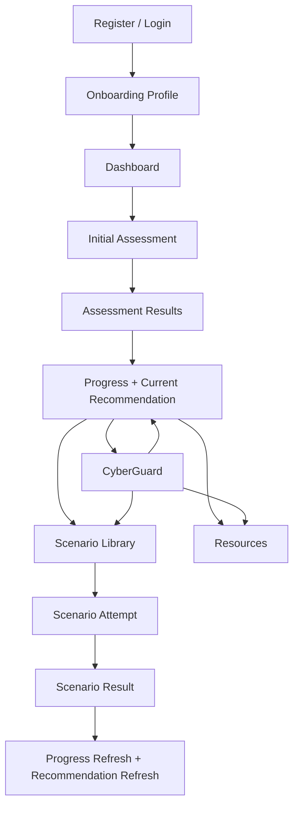
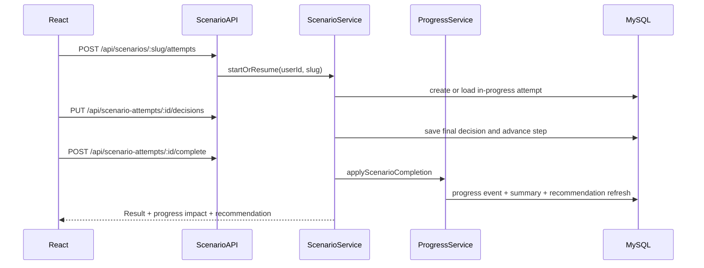
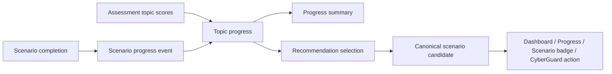
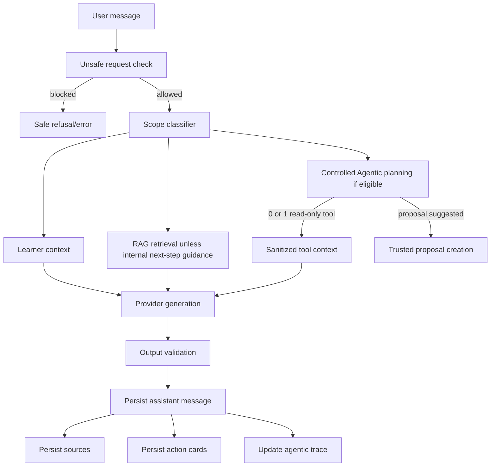
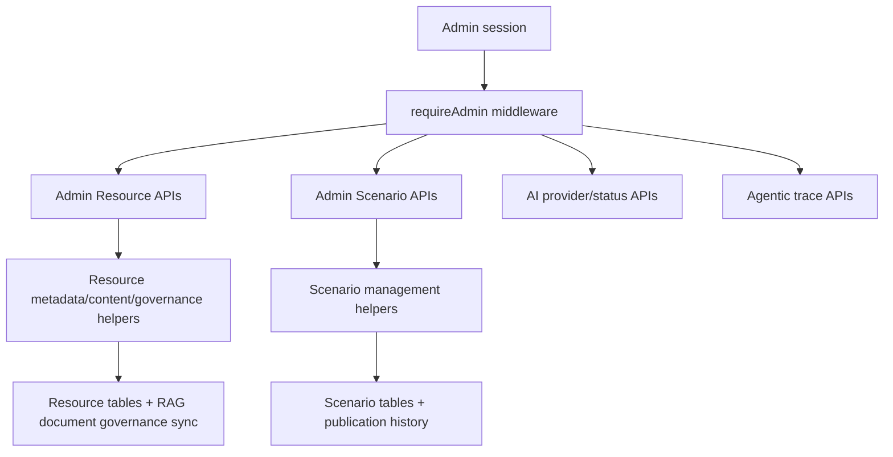

# 05. System Architecture Reconstruction

## Client Architecture

The official frontend is `client/`, not the legacy root `src/`. `README.md` states that `client/` is the official frontend and root `src/`/`public/` must not be extended.

The main application file is `client/src/App.jsx`. It contains hash-page parsing, authentication restore, learner pages, Admin routing, CyberGuard rendering, Resource/Scenario navigation bridges, and API wrapper functions. Shared admin components live under `client/src/admin/`. Chat mapping and safe target utilities live in `client/src/chat/`. Localization setup and strings live in `client/src/i18n/`.

## Server Architecture

The backend entry point is `server/server.js`. It:

- loads environment variables with `dotenv`;
- creates the Express app;
- configures CORS with `CLIENT_ORIGIN`;
- configures HTTP-only `express-session` cookies backed by MySQL;
- wires repositories/services for Profile, Assessment, Progress, Scenario, Resource, Chat, AI, RAG, Agentic AI, Adaptive Learning, Wellness, and Admin;
- mounts `/api/profile`, `/api/account`, assessment routes, progress routes, scenario routes, resource routes, `/api/chat`, action proposal routes, and `/api/admin`;
- exposes `/api/health`.

## Database Architecture

MySQL configuration is centralized in `server/src/database/pool.js`. The default database name is `cyberly`.

Migration files in `server/migrations/` define the main tables:

- `schema_migrations`, `users`: migration `001`
- user alignment and session hardening: migrations `002`-`004`
- `learner_profiles`: migration `005`
- assessment definitions/questions/attempts/answers/topic scores: migration `006`
- progress summary, topic progress, learner recommendations: migration `007`
- scenario definitions/steps/attempts/decisions/progress events: migration `008`
- assessment translations: migrations `009`-`010`
- scenario translations: migrations `011`-`012`, `025`
- resources and translations: migrations `013`-`015`, `022`, `023`
- chat conversations/messages/generations/actions/sources: migrations `016`-`021`
- scenario publication history: migration `024`
- agentic execution traces: migration `026`

## Authentication and Session Flow

Evidence: `server/server.js`, `server/src/auth/*`, `server/src/profile/*`, migration `004`, migration `005`.

## Learner Learning Journey

Evidence: frontend pages in `client/src/App.jsx`; services in `server/src/assessment/*`, `server/src/progress/*`, `server/src/scenario/*`, and `server/src/resource/*`.

## Assessment Flow

Assessment routes are in `server/src/assessment/assessment.routes.js`. The service and scoring rules are in `server/src/assessment/assessment.service.js` and `server/src/assessment/assessment.scoring.js`. Attempts and answers persist in tables created by migration `006`. Localized assessment content is stored through migrations `009` and `010`.

## Scenario Flow

Scenario routes are in `server/src/scenario/scenario.routes.js`. The service validates ownership, final choice behavior, scoring, completion, and progress application in `server/src/scenario/scenario.service.js`. Scoring is deterministic in `server/src/scenario/scenario.scoring.js`. Scenario recommendation selection is in `server/src/scenario/scenarioRecommendation.js`.

## Recommendation and Progress Flow

Progress logic is in `server/src/progress/progress.service.js`, `progress.repository.js`, `progress.rules.js`, `progress.composition.js`, and `learning-path-progress.service.js`. Current recommendation reads validate scenario actionability through the canonical scenario selector in `server/src/scenario/scenarioRecommendation.js`.

## CyberGuard and Agentic Boundary

Evidence: `server/src/ai/ai.service.js`, `server/src/ai/ai.prompts.js`, `server/src/rag/*`, `server/src/agent/*`, `server/src/agent/actions/*`, `server/src/agent/audit/*`.

## RAG Flow

RAG ingests published Resource translations into `rag_documents` and `rag_chunks` using `server/src/rag/rag.service.js`, `rag.repository.js`, and `rag.chunker.js`. Retrieval filters reviewed/published/RAG-ready content in `server/src/rag/rag.policy.js` and maps safe citation metadata in `server/src/rag/rag.mapper.js`. Sources included in the prompt are snapshotted into `chat_message_sources` by `server/src/ai/ai.repository.js`.

## Controlled Agentic Flow

Controlled Agentic planning is bounded:

- eligibility gate and plan execution: `server/src/agent/controlledAgentic.service.js`;
- provider/tool planning boundary: `server/src/agent/agentModelGateway.js`;
- canonical tool catalogue: `server/src/agent/agent.toolCatalogue.js`;
- read-only old-tool service: `server/src/agent/agent.service.js`;
- controlled executor: `server/src/agent/controlledToolExecutor.js`;
- learner-controlled proposals: `server/src/agent/actions/*`;
- traces: `server/src/agent/audit/*`.

## CMS Flow

Evidence: `server/src/admin/admin.middleware.js`, `server/src/admin/admin.routes.js`, `server/src/admin/admin.resourceMetadata.js`, `server/src/admin/admin.resourceContent.js`, `server/src/admin/admin.scenarioManagement.js`, `client/src/admin/*`.

